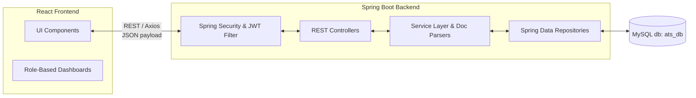

# System Architecture: Resume Screening ATS

## Overview
The application is a full-stack **Applicant Tracking System (ATS)** designed to allow Job Seekers to view jobs and upload their resumes and Recruiters/Admins to evaluate applications using automated text extraction. The architecture follows a standard client-server model containing a React.js front-end and a Spring Boot (Java) back-end.

## Core Technologies
*   **Frontend**: React.js (v18), React Router, Axios, CSS Modules.
*   **Backend**: Java 17, Spring Boot 3.2.5, Spring Security, Spring Data JPA.
*   **Database**: MySQL (connecting via `mysql-connector-j`).
*   **Authentication**: Stateless JWT (JSON Web Tokens).
*   **Document Processing**: Apache PDFBox for `.pdf` files, Apache POI for `.doc`/`.docx` files.

---

## High-Level Architecture Diagram

---

## Frontend Architecture (`PROJECT_ATS`)
Located in the `PROJECT_ATS/src/` directory, the frontend uses a component-based structure built with React.

*   **Dashboards/Roles**:
    *   `JobSeekerDashboard.jsx`: Interface for candidates to view open roles, apply, and monitor application status.
    *   `RecruiterDashboard.jsx`: Interface for recruiters to create/manage job postings and evaluate applicants.
    *   `AdminDashboard.jsx`: Administrative interface for system monitoring and user control.
    *   `Login.jsx`: Standard user authentication interface.
*   **Reusable Components**: Standard UI elements like `ApplicantTable.jsx`, `UploadBox.jsx`, `Sidebar.jsx`, `StatCard.jsx`, and visual elements like `ATSScoreCircle.jsx`.
*   **Styling**: The application utilizes CSS Modules (e.g., `JobSeeker.module.css`, `ApplicantTable.module.css`) to enforce scoped, component-specific CSS styling without bleeding styles globally.
*   **Networking**: Makes standard REST API calls to the backend running locally on `http://localhost:8080/` where Cross-Origin Resource Sharing (CORS) is explicitly enabled for `http://localhost:3000`.

---

## Backend Architecture (`backend`)
Located in `backend/src/main/java/com/ats`, the backend utilizes a layered monolithic structure adhering to best practices for separation of concerns.

### 1. Presentation Layer (Controllers)
REST controllers mapping to endpoints.
*   `AuthController`: Manages user lifecycle operations (login/registration) and issues short-lived JWT tokens.
*   `JobPostingController` / `ApplicationController`: Coordinates operations tied to job listings and applications.
*   `ResumeController`: Handles `multipart/form-data` uploads (max payload size logic set to 10MB in application configuration).
*   `AdminController`, `NotificationController`, `RecruiterController`: Handles specific role-based actions.

### 2. Business Logic Layer (Services & Processors)
The service layer performs core processing and manipulation decoupled from HTTP requests.
*   **Extractors**: Logic uses `Apache PDFBox` and `Apache POI` locally to consume uploaded binary files (`.pdf`, `.doc`, `.docx`) safely extracting the contained text. 
*   **ATS Scoring**: The extracted text strings from candidates' resumes are compared contextually against Job requirements to compute the "Match Score" displayed later to the recruiter.

### 3. Data Access Layer (Repositories & Entities)
Spring Data JPA handles underlying DB translations and object-relational mappings.
*   **Entities (`com.ats.model`)**: Strong typed models (`User`, `JobPosting`, `Application`, `Resume`, `RecruiterProfile`, `Notification`) annotated with `@Entity` with mapped relationships.
*   **Repositories (`com.ats.repository`)**: Interfaces extending `JpaRepository` supporting auto-generated SQL CRUD code and parameter-based querying bindings (e.g., `findByRole`, `findByJobPostingId`).
*   Configured dynamically to perform `update` schema updates (or DDL operations) on launch on top of a `MySQLDialect`.

### 4. Security Layer
*   Utilizes a stateless approach configured by defining `io.jsonwebtoken` parameters.
*   Validates `Bearer` signatures attached to incoming authentication headers across a custom filter configured within the `SecurityFilterChain`.
*   Enforces API boundary Role-Based Access Control (RBAC)—such as denying job seekers to POST inside job listings.

---

## Use-Case Data Flow: Resume Upload & Parsing
1.  **Frontend Selection**: Job seeker drops or selects a `.pdf`/`.doc`/`.docx` file leveraging `UploadBox.jsx`.
2.  **Request Over Network**: The file payload is encoded (`multipart/form-data`) carrying authorization tokens and sent to `POST /api/resumes/upload`.
3.  **Local Storage Engine**: Standard operations save the uploaded byte array into standard I/O storage in the active backend `uploads/resumes` directory as configured in `application.properties`.
4.  **Processor Evaluation**: Application determines the MIME type / extension. Triggers PDF to `PDFTextStripper` process or DOCX to Apache POI extractor algorithm.
5.  **Persistence**: Meaningful text content + structured metadata is placed into an instanced `Resume` model and `save()` is called at the DAO level mapping to MySQL DB elements.
6.  **Resolution**: Client receives `{success:true}` resolving UI loading states globally.
